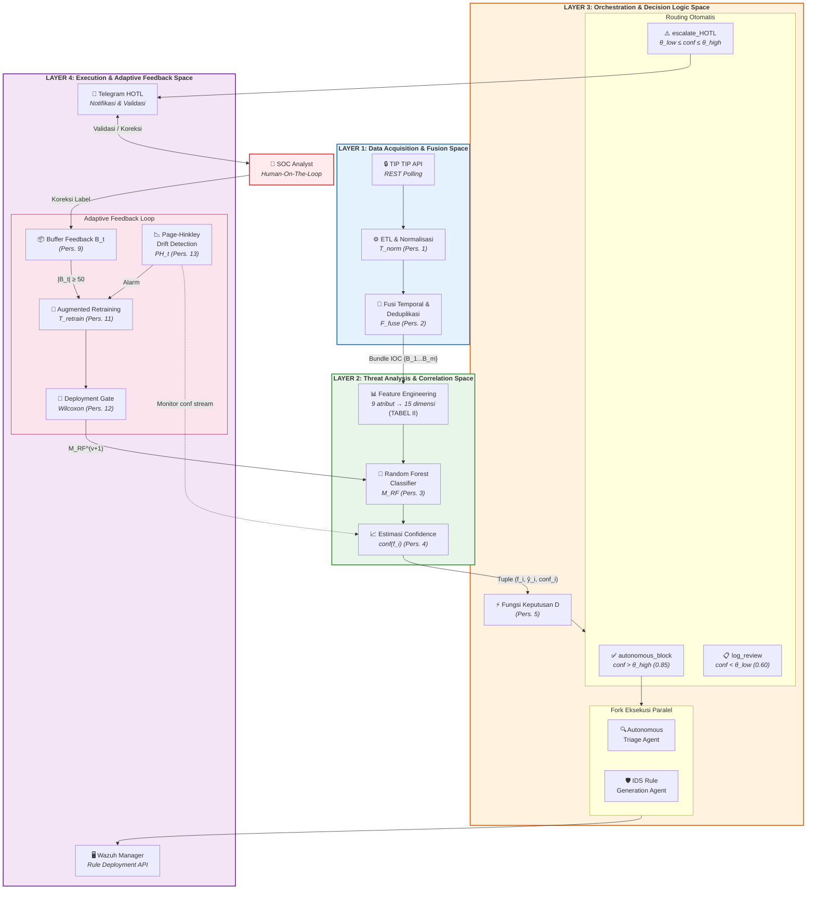
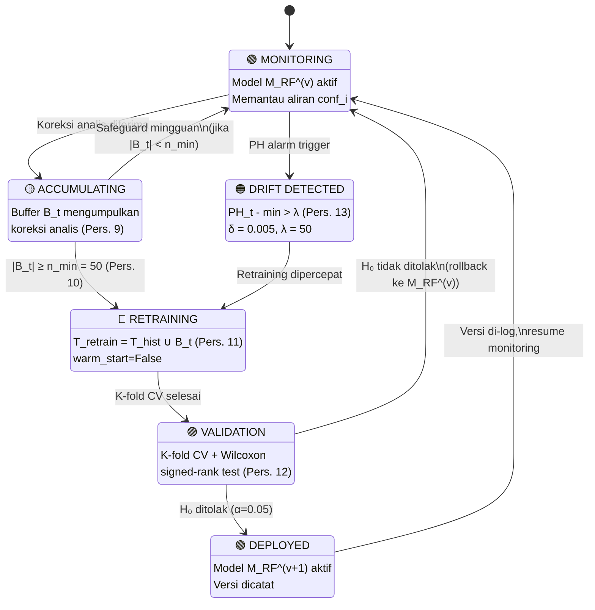

# Diagram Source Files for Cognitive SOC Manuscript

## Gambar 1: Arsitektur Pipeline Cognitive SOC (4-Layer)

Render this using Mermaid Live Editor (https://mermaid.live) or any Mermaid-compatible tool. Export as SVG or high-resolution PNG for the final manuscript.



---

## Gambar 2: Diagram Transisi State — Adaptive Feedback Loop



---

## Rendering Instructions

### Option A: Mermaid Live Editor (Recommended)
1. Go to [https://mermaid.live](https://mermaid.live)
2. Paste the Mermaid code block content
3. Export as **SVG** (vector, best for IEEE papers) or **PNG** (high-DPI)

### Option B: VS Code Extension
1. Install "Markdown Preview Mermaid Support" extension
2. Open this file in VS Code
3. Preview renders diagrams inline

### Option C: Command Line
```bash
npm install -g @mermaid-js/mermaid-cli
mmdc -i diagrams.md -o gambar1.svg -t neutral
```

### IEEE Formatting Notes
- Export at **minimum 300 DPI** for PNG
- SVG is preferred for vector quality in LaTeX/Word
- Use single-column width (~3.5 inches) or double-column width (~7 inches) depending on layout
- Caption format: "Gbr. 1. Arsitektur pipeline Cognitive SOC empat-lapisan."
